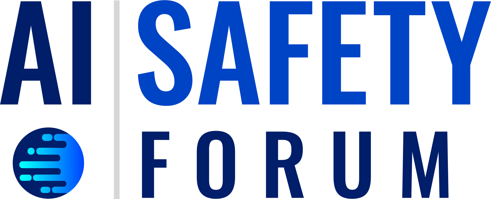

<!-- 

  

 -->

  

<!-- 

  <a href="https://aisafetyforum.au/program">Click for Forum Program</a>

 -->

  Thank you to everyone who attended the inaugural Australian AI Safety Forum!

  Recordings of the talks on Day 1 can be found <a href="https://youtube.com/playlist?list=PLPu7GaTnxbYxu4rV7tUDJjFB92aM8TjMi&feature=shared">here</a>, and the full program can be found <a href="https://aisafetyforum.au/program">here</a>.

# About the Forum
With the establishment of state-backed AI Safety Institutes in the [UK](https://url.au.m.mimecastprotect.com/s/7N6DCwV1vMfRRM0v0c9izHJzR60?domain=aisi.gov.uk/), [US](https://url.au.m.mimecastprotect.com/s/q1g9CxngwOfQQ6mLmhwsoHyBMej?domain=nist.gov), and other countries, and the release of the [Interim International Scientific Report on the Safety of Advanced AI](https://url.au.m.mimecastprotect.com/s/gMdjCyojxQTyyv676TNtgHx0dWt?domain=assets.publishing.service.gov.uk), the global focus on AI safety has recently intensified. 

The Australian AI Safety Forum is a two-day interdisciplinary event in Sydney on 7-8 November 2024 that builds on this momentum and focuses on the subset of AI developments and AI policy that are addressed by the AI Safety Institutes and Report. This forum, the first of its kind in Australia, aims to catalyse conversations on technical AI safety and governance while exploring Australia's unique role in the global AI safety landscape.

The forum takes the [Interim International Scientific Report on the Safety of Advanced AI](https://url.au.m.mimecastprotect.com/s/gMdjCyojxQTyyv676TNtgHx0dWt?domain=assets.publishing.service.gov.uk) as its scientific foundation, using its technical findings to frame and advance discussions on policy and governance within the Australian context. 

By grounding discussions in facts and stimulating dialogue among researchers, policymakers, and industry leaders, the forum seeks to establish an Australian community working on the challenges of technical AI safety and governance, with the intention of becoming a regular event. 
By bringing together diverse perspectives, the forum aims to inspire new collaborations and serve as a starting point for those in Australia interested in contributing to AI safety.

# Program

The program for the 2024 Forum can be found [here](https://aisafetyforum.au/program). 

# Key Details

**Date:** 7th-8th November 2024. 

- **Day 1 (Thursday 7th Nov):** Forum 9am-5pm. Networking drinks reception 5pm to ~7pm (details to be confirmed). 
- **Day 2 (Friday 8th Nov):** Forum 9am-4pm. 

**Location:** Sydney Knowledge Hub, The University of Sydney

**Format:** Two-day interdisciplinary conference, a mix of talks, panels and workshops, with a detailed program to be confirmed. 

- **Day 1 (Thursday 7th Nov):** Single-track program introducing AI safety from both technical and governance perspectives. The day will feature keynote speeches from international AI safety experts, interspersed with panel discussions.
- **Day 2 (Friday 8th Nov):** Mainly parallel workshop sessions where participants will collaborate on addressing key questions in AI safety, with a focus on Australia's potential contributions to the field.

**Cost:** Free 

# Speakers

We are delighted to announce the following group of distinguished keynote speakers for the event:

- [Marcus Hutter](http://www.hutter1.net), Australian National University
- [Hoda Heidari](https://www.cs.cmu.edu/~hheidari/), Carnegie Mellon University 
- [Atoosa Kasirzadeh](https://kasirzadeh.org), Carnegie Mellon University
- Ryan Kidd, ML Alignment & Theory Scholars (MATS)
- [Seth Lazar](https://sethlazar.org), Australian National University
- [Nitarshan Rajkumar](https://www.nitarshan.com), University of Cambridge

# Participants
This forum is designed for a diverse group of participants, including:

- Researchers in mathematics, computer science, natural sciences and the social sciences
- Policymakers
- Legal experts and public policy professionals
- National security and cybersecurity specialists
- Industry professionals (e.g., finance, telecommunications)
- Students and early-career professionals interested in AI safety and governance

# Forum Topics
A non-exhaustive list of topics for discussion includes: 
- **Foundations of AI safety**: What is AI safety, what is "alignment", and why does it matter?
- **International AI safety landscape**: Introduction to the [International Scientific Report on the Safety of Advanced AI](https://assets.publishing.service.gov.uk/media/6655982fdc15efdddf1a842f/international_scientific_report_on_the_safety_of_advanced_ai_interim_report.pdf).
- **Australia's role**: How can Australia contribute to global AI safety efforts? What are its unique strengths? 
- **Technical AI safety**: What are the central technical research questions and how do they relate to policy? Are there blindspots in the current paradigm? 
- **Science of AI**: What are the avenues to better understanding AI scientifically? 
- **AI governance**: How does product regulation work for AI systems? What are the open problems in technical AI governance? 
- **Evaluations for AI**: What are capabilities and how do we measure them?
- **Safety engineering**: What can AI safety learn from other fields of product safety engineering? 
- **Risk assessment**: What is "high-risk AI" and how do we address it?
- **Cross-sector communication**: What communication channels should exist between technical researchers, policymakers, and industry? How can we talk to one another? 

# Organisers
This inaugural event is organised by the following committee: 
- [Tiberio Caetano](https://www.gradientinstitute.org/about-us/team/tiberio-caetano/), [Gradient Institute](https://www.gradientinstitute.org)
- [Liam Carroll](https://www.gradientinstitute.org/about-us/team/liam-carroll/), [Gradient Institute](https://www.gradientinstitute.org) / [Timaeus](https://timaeus.co)
- [Daniel Murfet](http://therisingsea.org/), The University of Melbourne
- Greg Sadler, [Good Ancestors Policy](https://www.goodancestors.org.au)
- [Alexander Saeri](https://www.aksaeri.com), The University of Queensland / MIT FutureTech
- [Kim Weatherall](https://www.sydney.edu.au/law/about/our-people/academic-staff/kimberlee-weatherall.html), The University of Sydney
- [Geordie Williamson](https://www.maths.usyd.edu.au/u/geordie/), The University of Sydney

# Partners
This event is made possible thanks to the support of the following organisations: 
- [Sydney Knowledge Hub](https://www.sydney.edu.au/engage/industry-business-partnerships/sydney-knowledge-hub.html)
- [Digital Sciences Initiative](https://dsi.sydney.edu.au) at the University of Sydney
- [Faculty of Arts & Social Sciences (FASS)](https://www.sydney.edu.au/arts/) at the University of Sydney
- [Faculty of Engineering](https://www.sydney.edu.au/engineering/) at the University of Sydney 
- [Open Philanthropy](https://www.openphilanthropy.org)
- [Gradient Institute](https://www.gradientinstitute.org)
- [Sydney Mathematical Research Institute](https://mathematical-research-institute.sydney.edu.au)
- [Timaeus](https://timaeus.co) 

# Contact
If you have any questions, please contact Liam Carroll at liam.carroll@gradientinstitute.org . 